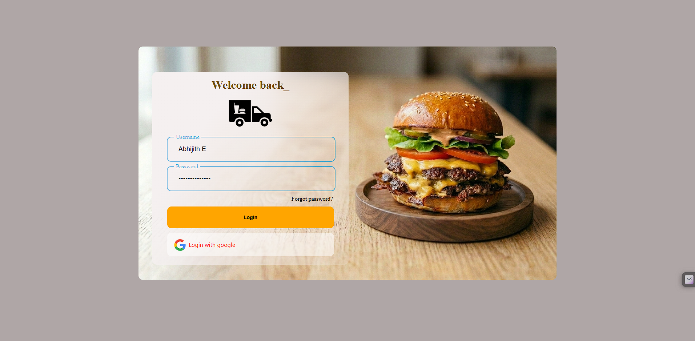

# Login Page UI

A modern and responsive login page UI built using **HTML and CSS**.  
The design includes a background image layout with a floating login card, clean input fields, and smooth UI interactions.

---

## Features

- Modern login card design
- Full background image layout
- Floating input labels
- Google login button UI
- Responsive design
- Smooth hover animations
- Clean and organized CSS structure

---

## Technologies Used

- HTML5
- CSS3
- Flexbox
- CSS Positioning
- CSS Transitions
- SVG Icons

---

## Live Demo

live link : 

## Screenshot



## Project Structure

```bash
login-page-ui/
│
├── images/
│   └── background images
│   └── screenshot.png
│
├── icons/
│   └── svg icons
│
├── index.html
├── style.css
└── script.js
```
